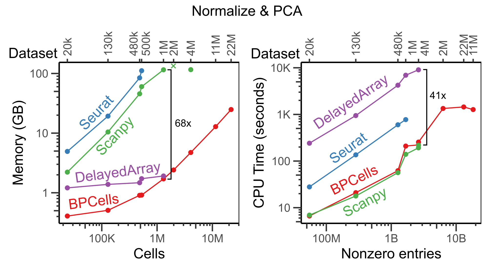
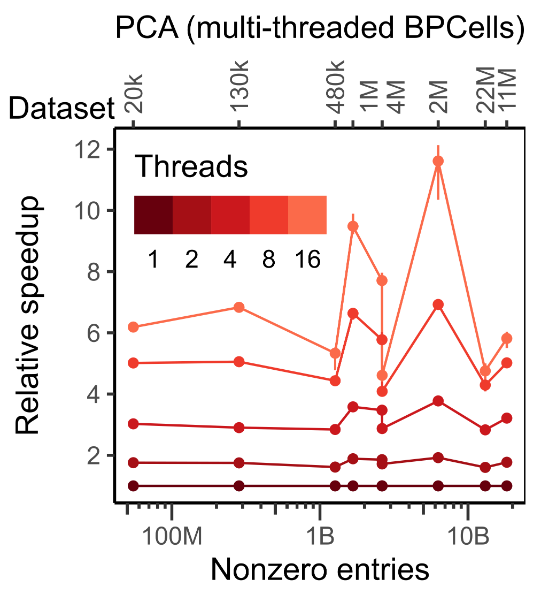
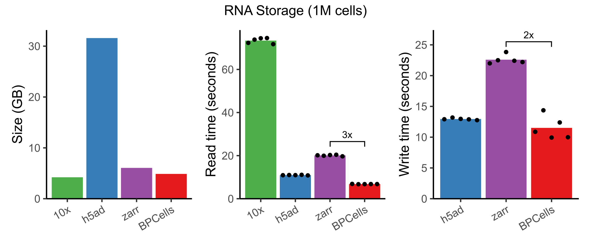
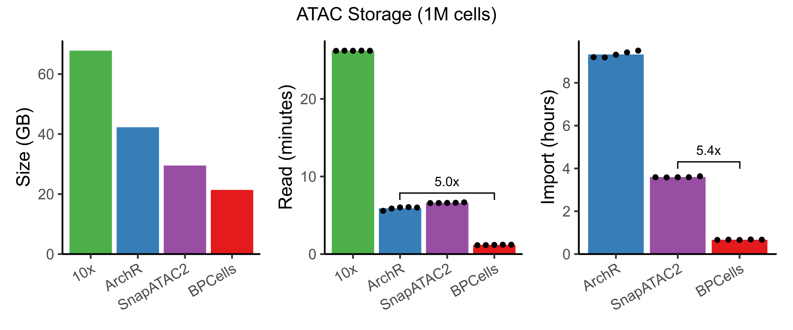
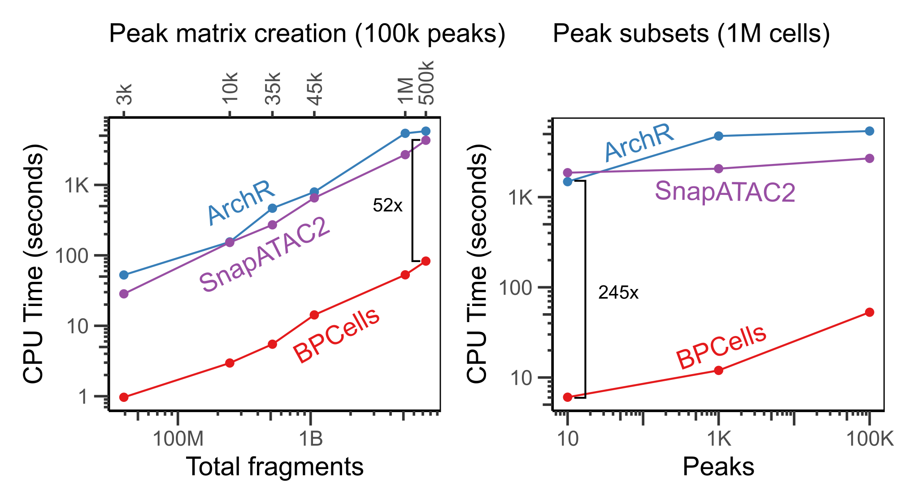
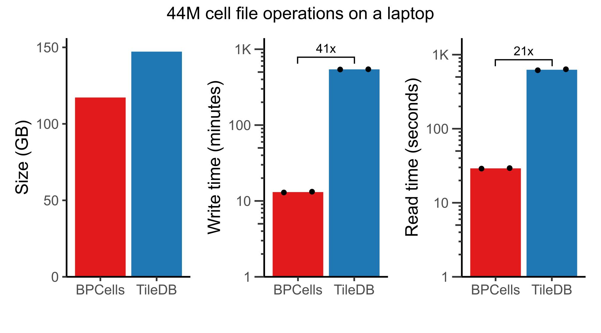
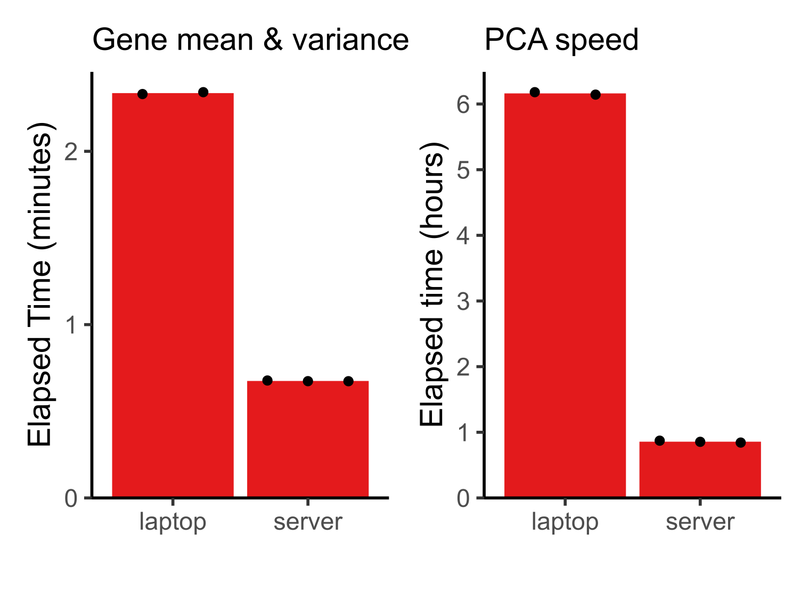

<!-- This is to make sure the logo file gets copied to output on a full website rebuild  -->
These performance benchmarks are based on extensive benchmarks from the [BPCells
manuscript](https://www.biorxiv.org/content/10.1101/2025.03.27.645853v1). 
Full benchmarking/plotting code and data TSVs are available 
[here](https://github.com/GreenleafLab/BPCells_paper).
These numbers are just a snapshot of tool performance as of December 2024, so we encourage
you to check performance on your own datasets with the latest versions of all software packages
to get the most up-to-date results.

## RNA-seq normalization + PCA

Because BPCells can perform all operations streaming from disk, it is able to
use dramatically less memory than traditional in-memory workflows. We have
also extensively optimized the underlying C++ code to make BPCells much faster than traditional
disk-backed tools like DelayedArray.

In the benchmark below, we show the time and memory usage to perform a standardized workflow
of data normalization, variable gene selection, and PCA. Note that we
show Seurat's in-memory workflow, though Seurat v5 also offers a BPCells integration
for disk-backed operations. All tools were given a 3 hour time limit and up to 256GB of RAM,
but only BPCells was able to process the largest datasets within these resource limits.

Notice that execution speed tends to scale with the number of non-zero entries in a matrix, whereas memory usage
for BPCells scales with the number of cells (i.e. space required to store the output PCA embeddings).

### Multi-threading
The above benchmark was run single-threaded since not all tools support
multi-threading. However, BPCells can offer 5-10x speedups with multiple threads:

## Bitpacking compression

### Counts matrices (RNA or ATAC)

BPCells uses bitpacking compression to help speed up disk-backed workflows. While
general purpose compression algorithms shrink file sizes and reduce disk read bandwidth,
they typically come at a high compute cost. BPCells is able to provide similar space
savings to general-purpose compression algorithms like gzip (10x HDF5) and LZ4-Blosc (zarr),
but with much lower compute cost. AnnData h5ad files default to not using compression due to the speed costs for read/write,
but with BPCells bitpacking compression we can get faster read/write with 4-7x space savings.

Here, we benchmark storing + loading a 1.3M cell RNA-seq experiment from 10x Genomics, using
default compression settings for each storage format[^2]. Notice that only BPCells is the only compressed
format fast enough to provide faster read and write speeds than an uncompressed h5ad[^1].

[^2]: 10x HDF5: gzip; h5ad: none, AnnData zarr: LZ4-Blosc, BPCells: bitpacking
[^1]: These benchmarks were run single-threaded on local SSD storage, which is the hardest scenario to outperform uncompressed formats.

Note that we don't benchmark 10x HDF5 write, since 10x does not directly provide software to perform
arbitrary matrix writes. It would likely be even slower than the 10x read speed.

### Fragment alignments (ATAC)

In addition to RNA/ATAC counts matrices, BPCells also introduces compressed file formats
for scATAC-seq fragments. We compared to 10x fragment files, ArchR, and SnapATAC2 for storage
of a 1M cell dataset, and found that BPCells gave the smallest file sizes and fastest read/write speeds.

By using bitpacking compression, BPCells can afford the storage space to keep fragments in fully genome-sorted order.
This makes import from 10x fragment files dramatically faster compared to ArchR and SnapATAC2 which must re-sort
fragments to be grouped by cell. We'll see later that it also speeds up genomic overlap calculations.

## ATAC-seq overlap calculations

When working with large reference datasets, it's often helpful to be able to quickly 
re-quantify cell x peak overlap matrices directly from fragments, as datasets all usually use
different sets of peak coordinates depending on the biology of interest. BPCells stores fragments in
genome-sorted order, so it's able to perform peak calculations much faster than ArchR or SnapATAC2.

BPCells takes only seconds to find all overlaps with a small set of 10 peaks, which also means that it is
very fast at calculating genomic coverage tracks for visualization of large datasets.

## 44M cell analysis of CELLxGENE census

With the combination of fast storage and disk-backed compute, BPCells is able to handle all unique human cells from
the CELLxGENE census on a laptop with 16 threads and 32GB of RAM. Compared to the TileDB matrix storage format, we found that the BPCells file formats offer
much faster read/write times at similar space usage[^3]. Note that this dataset would take over 750GB to store the counts matrix without
compression.

[^3]: These plots show the BPCells feature-major layout compared to TileDB with raw counts. See the BPCells manuscript for timing
information on servers and for additional matrix variants. Write time is time to subset the CELLxGENE census to remove duplicate cells,
including the time to swap storage order from cell-major to feature-major for BPCells.

Because of these much faster file read speeds, BPCells is able to do light compute tasks like computing per-gene mean and variance across 44M cells
in <3 minutes. PCA is the most expensive operation BPCells performs, using 167 passes over the input matrix to calculate 32 PCs. Still, it completes
in less than 1 hour on a server and 6.2 hours on a laptop. This makes atlas-scale analysis possible on a laptop while leaving headroom on a server for datasets
up to an order of magnitude larger.

Benchmark details: Mean and variance computed on a log-normalized matrix, unlike the plots in the BPCells manuscript which were just scaled by read counts
to match the default normalization of the CELLxGENE census. Laptop has 32GB of RAM and 16 threads; server has 256GB of RAM and 32 threads. See [BPCells
manuscript](https://www.biorxiv.org/content/10.1101/2025.03.27.645853v1) for further details.

# Update log
- March 29, 2025: Update benchmarks with numbers + performance from BPCells manuscript.
  - Normalization & PCA: Add more comparison datasets, add DelayedArray results, and add multithreading plot
  - RNA storage: Add comparisons with zarr and include write times.
  - ATAC storage: Add 10x and SnapATAC2 results and include read times, and switch comparison to be on a larger dataset.
  - Peak matrix: Update benchmarks to show cross-dataset results at 100k peaks, and peak subset results on 1M cells rather than 30k cells.
    Add in comparisons to SnapATAC2.
  - Add results for 44M cell analysis.
- March 30, 2023: Added clarification that AnnData benchmarks referred to h5ad with
  default compression settings (i.e. none).
- March 29, 2023: Created benchmark page.