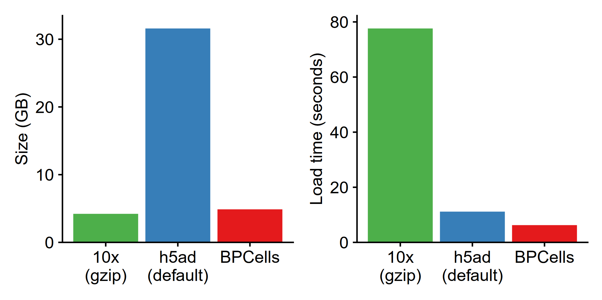

Note: these performance benchmarks are preliminary while our manuscript is in
preparation, though every effort has been made to present a fair comparison with
other tools. Fortunately, it is straightforward to install and test BPCells on
your own dataset to replicate our claims.

## RNA-seq normalization + PCA
Because BPCells can perform all operations streaming from disk, it is able to
use dramatically less memory for operations that read all matrix values. This
chunking strategy is similar to tools like DelayedArray. We have extensively
optimized the C++ code to avoid slowdowns commonly caused by using disk-backed
computations.

In the benchmark below, we show the time and memory to perform a basic workflow
of data import, normalization, variable gene selection, and PCA. We reproduce
the PCA results of existing tools to within numerical precision, starting from
raw counts[^2].

[^2]: In this case, our PCA embeddings have a mean relative difference of about
0.02% compared to the original tool. In this benchmark we are matching the
results of `scanpy.pp.recipe_zheng17`, though we can also match the results of
Seurat's analysis to similar precision.

Note that Seurat in this plot crashes on the 1.3M cell dataset due to R sparse
matrices not supporting over roughly 2 billion non-zero entries in a matrix. By
utilizing Seurat v5's BPCells integration, it is possible to perform analyses on
million cell datasets without downsampling.

## Bitpacking compression

### Counts matrices (RNA or ATAC)

Single cell counts matrices are stored as sparse matrices. With traditional
formats like AnnData or 10x hdf5 feature matrices, there is an inherent tradeoff
between storage size and speed of loading. Gzip-compressed files are small, but
slow to read.

BPCells uses bitpacking compression to provide 4-6x smaller storage for counts
matrices compared to an uncompressed binary format (e.g. AnnData's default h5ad
settings[^3]). A single thread can load the matrix data faster than reading
uncompressed data in many cases, due to the smaller data size and extremely fast
decompression[^1].

[^1]: This holds true for file storage that loads at under ~2GB/s, which is ~8x 
faster than a hard drive, and 16x faster than a gigabit ethernet connection.

[^3]: Note that AnnData supports a wide variety compression algorithms, though
for counts matrices BPCells bitpacking is also faster than lz4 and zstd read/write.

Benchmark storing + loading a 1.3M cell RNA-seq experiment from 10x Genomics.

### Fragment alignments (ATAC)

Single cell ATAC-seq data is stored as lists of fragment alignments, including
chromosome, start+end coordinates, and cell ID. The storage space for the
BPCells bitpacked format is about 2x smaller than a 10x fragments.tsv.gz file.
The storage format includes a lightweight genome-position index to enable fast
loading of data from a selected genome location.

BPCells can decompress about 70 million fragments per second with a single core,
compared to about 5 million fragments per second with a 10x fragments.tsv.gz
file (14x faster). Compared to ArchR arrow files, BPCells is also about 2x
smaller with ~10x faster import times from fragments.tsv.gz files.

## ATAC-seq overlap calculations
BPCells stores fragments in a genome-indexed format that also enables fast
seeking by genome location. This helps for visualization of selected genomic
loci, as well as fast calculations of cell x peak matrices. It is often
necessary to re-quantify the cell x peak matrices from fragments when comparing
datasets with different original peak calls. Our implementation is about 40x
faster than ArchR when calculating overlaps at 100k peaks across the genome, and
over 500x faster when calculating overlaps at just 10 peaks. This is due to the
fact that BPCells has fragments sorted by genome coordinate, whereas arrow files
sort by cell then genome coordinate.

Our peak matrix overlap calculation runs at a rate of about 25 million
overlapping fragments per second, which is fast enough that it would bottleneck
on I/O speed rather than computation when reading from a 250MB/s hard drive if
bitpacking compression were not available to reduce the I/O bandwidth.

